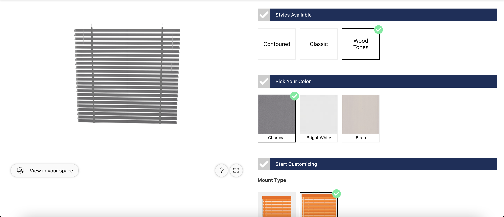

📢 Use this project, [contribute](https://github.com/{OrganizationName}/{AppName}) to it or open issues to help evolve it using [Store Discussion](https://github.com/vtex-apps/store-discussion).

# Threekit Proof of Concept (VTEX)

<!-- DOCS-IGNORE:start -->
<!-- ALL-CONTRIBUTORS-BADGE:START - Do not remove or modify this section -->

<!-- ALL-CONTRIBUTORS-BADGE:END -->
<!-- DOCS-IGNORE:end -->

This VTEX IO app provides base functionality for an integration with [Threekit's Treble library](https://treble.threekit.com/).

We are leveraging Treble's npm package to provide an API connection and drive attributes for product configuration. This app should be viewed and treated as a proof of concept, and not a production-ready application.

## Configuration

In order to properly install and utilize this app, follow the steps below:

1. Adding the app as a theme dependency in the `manifest.json` file:
   - `vtex.threekit-app@0.x`
2. Declaring the app's main block in a given theme template (typically PDP) or inside another block from the theme.
3. Setup a `Configuration` Service in your VTEX catalog
   - It should leverage a key called Data, or change the code accordingly.
4. Setup an `Asset ID` product specification in your catalog for the app to pull down a respective asset from Threekit.

<!-- Next, add the **props table** containing your block's props.

If the app exports more than one block, create several tables - one for each block. For example:

### `block-1` props

| Prop name | Type     | Description | Default value |
| --------- | -------- | ----------- | ------------- |
| `XXXXX`   | `XXXXXX` | XXXXXXXX    | `XXXXXX`      |

### `block-2` props

| Prop name | Type     | Description | Default value |
| --------- | -------- | ----------- | ------------- |
| `XXXXX`   | `XXXXXX` | XXXXXXXX    | `XXXXXX`      |

Prop types are:

- `string`
- `enum`
- `number`
- `boolean`
- `object`
- `array`

When documenting a prop whose type is `object` or `array` another prop table will be needed. You can create it following the example below:

- `propName` object:

| Prop name | Type     | Description | Default value |
| --------- | -------- | ----------- | ------------- |
| `XXXXX`   | `XXXXXX` | XXXXXXXX    | `XXXXXX`      |

Remember to also use this Configuration section to **showcase any necessary disclaimer** related to the app and its blocks, such as the different behavior it may display during its configuration.

## Modus Operandi _(not mandatory)_

There are scenarios in which an app can behave differently in a store, according to how it was added to the catalog, for example. It's crucial to go through these **behavioral changes** in this section, allowing users to fully understand the **practical application** of the app in their store.

If you feel compelled to give further details about the app, such as it's **relationship with the VTEX admin**, don't hesitate to use this section.

## Customization

The first thing that should be present in this section is the sentence below, showing users the recipe pertaining to CSS customization in apps:

`In order to apply CSS customizations in this and other blocks, follow the instructions given in the recipe on [Using CSS Handles for store customization](https://vtex.io/docs/recipes/style/using-css-handles-for-store-customization).`

Thereafter, you should add a single column table with the available CSS handles for the app, like the one below. Note that the Handles must be ordered alphabetically.

| CSS Handles |
| ----------- |
| `XXXXX`     |
| `XXXXX`     |
| `XXXXX`     |
| `XXXXX`     |
| `XXXXX`     |

If there are none, add the following sentence instead:

`No CSS Handles are available yet for the app customization.` -->

<!-- DOCS-IGNORE:start -->

## Contributors ✨

Thanks goes to these wonderful people:
- [@wesveio](https://github.com/wesveio)
- [@benparsell](https://github.com/benparsell)
- [@tiago-freire](https://github.com/tiago-freire)

<!-- ALL-CONTRIBUTORS-LIST:START - Do not remove or modify this section -->
<!-- prettier-ignore-start -->
<!-- markdownlint-disable -->
<!-- markdownlint-enable -->
<!-- prettier-ignore-end -->

<!-- ALL-CONTRIBUTORS-LIST:END -->

<!-- DOCS-IGNORE:end -->

